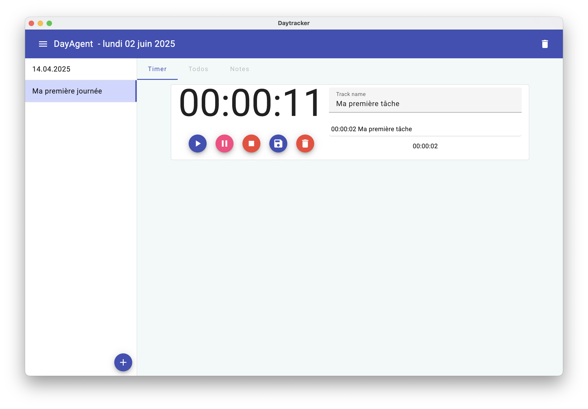
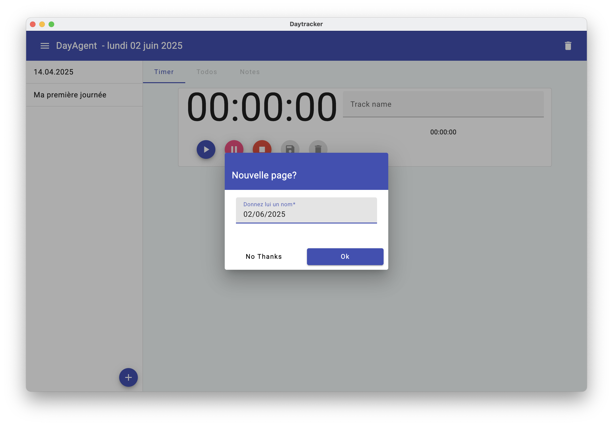
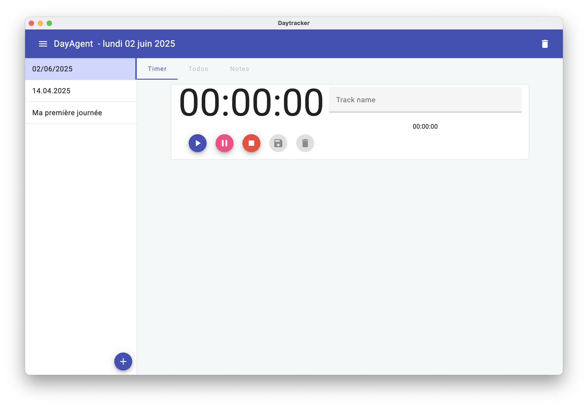

# DayAgent
<p align="center">
  
</p>

## Update & Run
```
bash run.sh
```

## Run localy

```
npm i
json-server --watch src/app/common/mock/database.json --port 25564   
npm start
or
npm run electron
```

## Screenshots
<p align="center">
  
</p>

<p align="center">
  
</p>

<p align="center">
  
</p>
